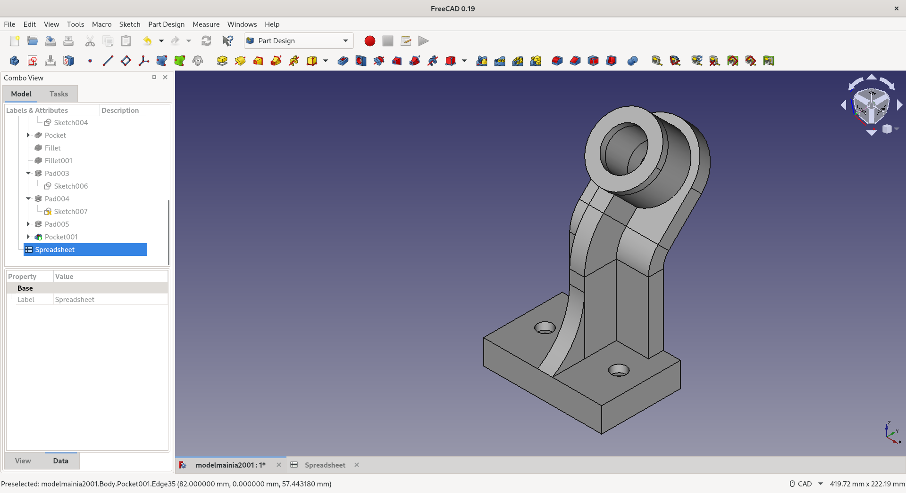
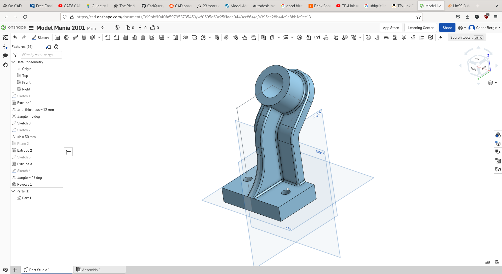
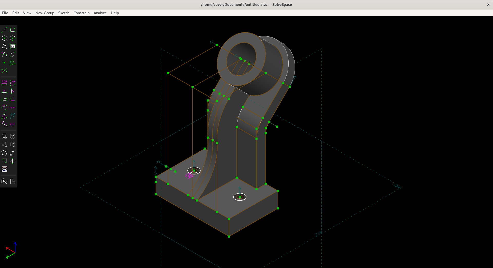

With cheap 3D printers and PCB manufacturing services you could concieve a piece of hardware and almost have a physical prototype on your desk in the same week.
CNC and laser cutting are also becoming cheaper and more available.
More people are getting involved with small scale manufacturing.
The sort of person that buys a 3D printegr is just as likely to have a programming hobby as they are to be handy.
It is quite common to see hardware projects on github that have the firmware source code, STLs for the 3D printed portion, and Gerber files for the PCB.
To assemble them you need to be able to solder, glue and operate a screwdriver.

This new sort of manufacturing is very much inline with the hacker tradition.

## Defining Terms
CAD packages are defined by their underlying data structures.
2D CAD is relatively simple, all they are are specialized vector editiors.
3D CAD is a step up in complexity. 3D CAD will usually have a facility for making 2D sketches.

Complex solid models can be built using Constructive Solid Geometry (CSG), which is simply a tree of boolean operations, or Binary Representation (B-Rep), which relates individual surfaces to one another.

## Availability
Before you even open a program there are a few things that make your life much easier:
Cross platform -- most CAD packages exclusively run on Windows, a select few also run on macOS and almost none run on Linux. There is no guarantee that someone doing engineering work is running Windows, many programmers prefer macOS and Linux.
Easy to purchase -- that means being able to get a copy of the software for free or at a fair price without having to jump through a buch of hoops.
Easy to install -- doesn't take hours to install.

## Comparison

I decided to do a small comparison of the various CAD programs available to me on Linux.
I made the same part in each, from the [2001 Model Mania](https://blogs.solidworks.com/tech/2022/02/23-years-of-model-mania.html).
This is hardly science, but by timing myself I did get a better idea of how efficient I was in each program.

The model is fairly straight forward, but for fact that two important dimensions are not given, but have to be calculated.
There is a dimension for the angle of the bend, but no dimension for the extrustion from the base to the end, there is also no dimension for the section after the bend.
The challenge is in two phases, you make one part, then make a slightly different one.
If you make a good parametric model, phase 2 will be painless, if you made a dogs dinner, you might find yourself dealing with various unintended consequences.

<figure><figcaption>Phase 1</figcaption></figure>
<figure><figcaption>Phase 2</figcaption></figure>

### FreeCAD

Done in an hour and a half, no fillets.

Plenty of time was wasted trying to figure out why my second sketch wouldn't attach to my first extrude, FreeCAD is quite particular when it comes to these things. Aside from that I worked realtively quickly.

To solve the dimensioning problem I made a spreadsheet which would take the lengths and do a bit of trigonometry to work out the lengths.
This worked pretty well, really I should have just used a sketch which contained all the information and used that as my single source of truth.

I didn't make any fillets, FreeCAD seems to have difficulty filleting anything non-trivial.

### OnShape

Done in an hour, with fillets.

Onshape is browser based, which I am not a fan of, I wish they would at least make it into an electron app.
OnShape is very similar to Solidworks, which is what I'm used to.
Where these programs shine is how little they get in your way.
FreeCAD will force you to think carefully about what you are doing, or you will get bitten.
OnShape, like Solidworks, will let you get away with things, so you have to remember to structure your work logically, or you will end up with some real abominations.

I solved the dimensioning problem with a driving sketch, the extrudes were defined using planes attached to the sketch.
This meant I didn't have to do any pen and paper calculations.
I probably could have done this with FreeCAD if it had occured to me.

And the filleting worked perfectly.
 

### Solvespace

Done in an hour and a half, no fillets, not parametric.

I had used Solvespace briefly before, and I knew that extrudes in solvespace can be pushed and pulled before they are dimensioned.
I hoped that I could use a couple of unconstrained extrudes for the unspecified lengths and the model would solve itself if I put the correct external dimensions on it. This didn't work, so I gave up. I could have finished the model in about the same time as the FreeCAD version, to a similar standard (solvespace can't do fillets at all).

### CADQuery

I liked the idea of CADQuery, and went in thinking I would find it quite usable.
I was quickly dissuaded.
Not being able to just click on a point to constrain it to another point, having to work out the dimensions and relative positions of everything to.

## Conclusion

The best option for someone looking to learn a CAD is propietary software like OnShape, Fusion 360 or Solidworks.
OnShape is particulary attractive because it runs in the browser, and does all the heavy lifting on its own servers, and has a free tier.
The next best option is FreeCAD.
It's slow, finicky and has less features, but it works.
